<div align="center">

<br>

<!-- REPLACE with your banner image (1200x400px, dark background) -->
<!-- Recommended: screenshot of the app with the echoes logo overlaid -->
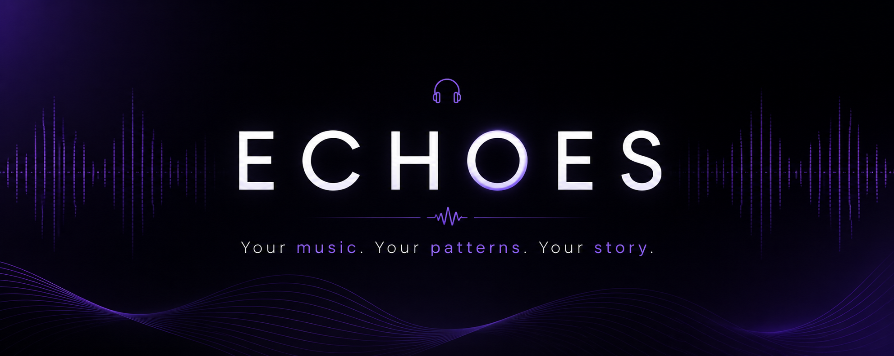

<br>

# echoes
### *your music, reflected back*

<br>

[](https://python.org)
[](https://streamlit.io)
[](https://scikit-learn.org)
[](https://last.fm)
[](https://huggingface.co)
[](LICENSE)

<br>

> You type **"3am rain on a window, a little broken"**
> echoes builds you a playlist.
> Not from a generic algorithm — from **your** listening history,
> **your** taste clusters, and a mood-parsing engine
> that understands what you actually mean.

<br>

**[🚀 Live Demo](https://echoes.streamlit.app)** &nbsp;·&nbsp; **[📓 Notebooks](notebooks/)** &nbsp;·&nbsp; **[📊 Results](#-key-results)**

<br>

</div>

---

<br>

## ✦ the app

<!-- REPLACE: Full-width screenshot of the echoes home page -->
<!-- Recommended size: 1400x900px -->
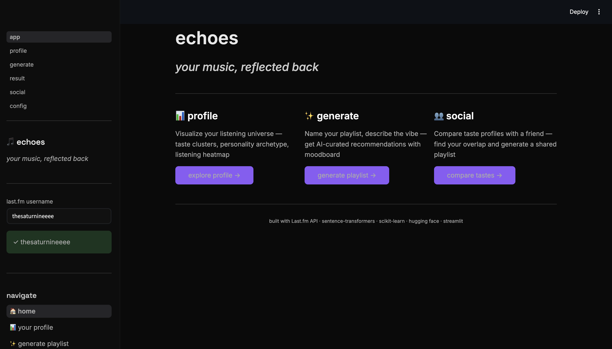

<br>

<table>
<tr>
<td width="50%">

### 📊 your profile
Visualize your listening universe.
Personality archetype · radar chart ·
top artists · heatmap · taste clusters ·
listening timeline

<!-- REPLACE: Profile page screenshot (700x500px) -->
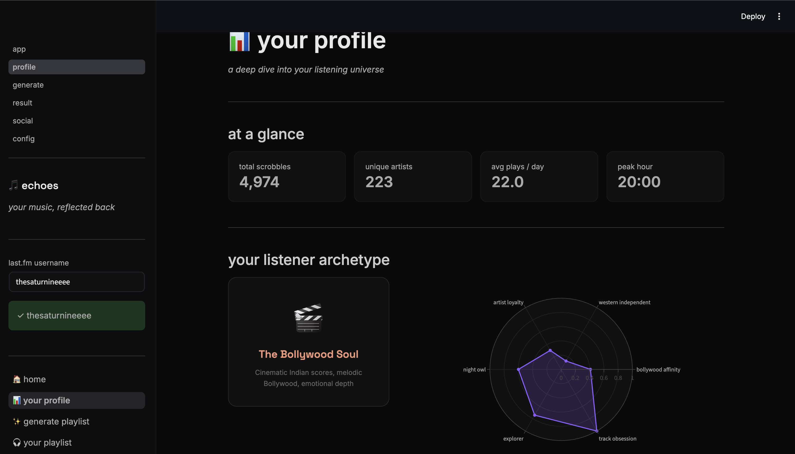

</td>
<td width="50%">

### ✨ generate
Name your playlist. Describe the vibe.
The NLP engine parses it into audio feature
weights and curates tracks from your
actual taste fingerprint.

<!-- REPLACE: Generate page screenshot (700x500px) -->
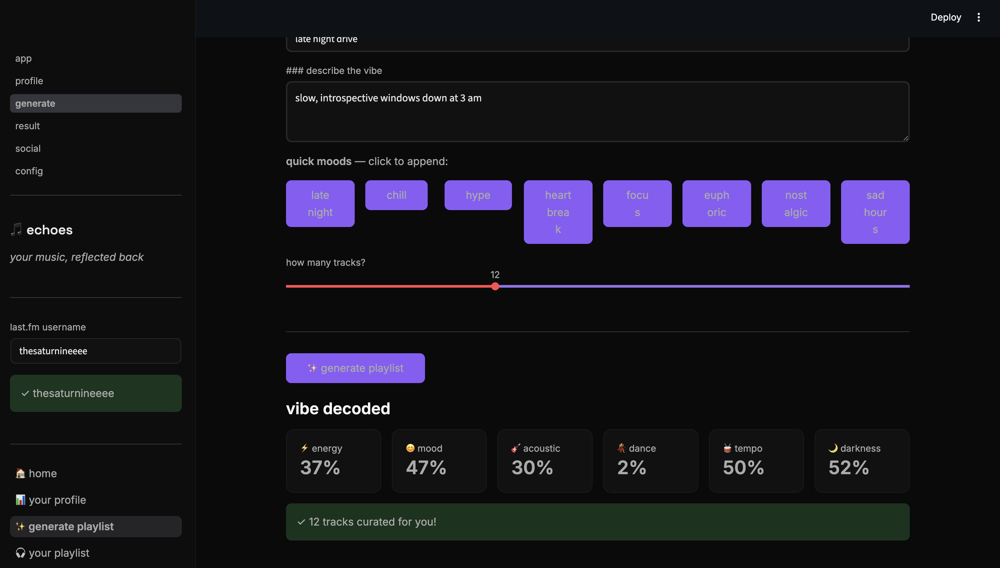

</td>
</tr>
<tr>
<td width="50%">

### 🎧 your playlist
Real song titles · artist tags ·
explainability scores · vibe radar ·
cinematic moodboard

<!-- REPLACE: Result page tracks tab screenshot (700x500px) -->
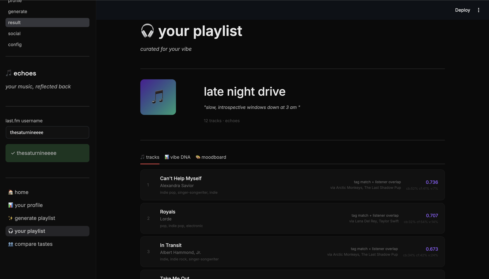

</td>
<td width="50%">

### 👥 compare tastes
Enter two Last.fm usernames.
Taste overlap score · compatibility label ·
shared artists · playcount comparison ·
blended playlist

<!-- REPLACE: Social page screenshot (700x500px) -->
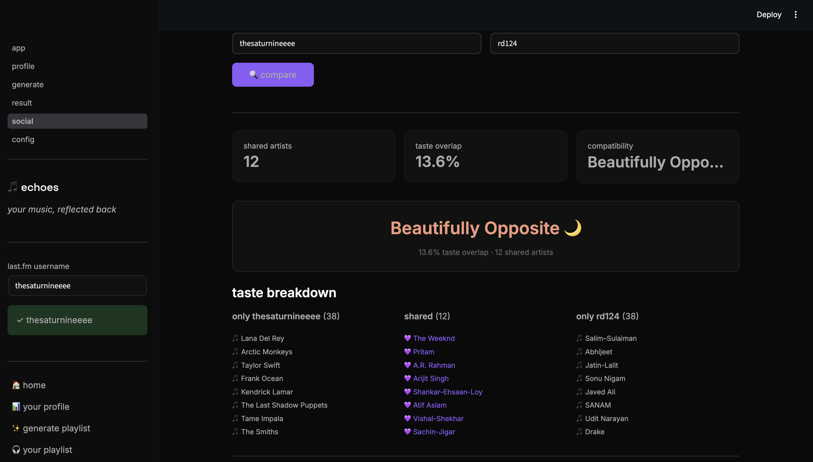

</td>
</tr>
</table>

<br>

---

<br>

## ✦ how it works

```
                    ┌─────────────────┐
                    │   Last.fm API   │
                    └────────┬────────┘
                             │
           ┌─────────────────┼─────────────────┐
           │                 │                 │
      listening          artist tags       similar
      history            folksonomy        artists
      (57,045             (TF-IDF)         (collab
      scrobbles)                           signal)
           │
           ▼
    ┌──────────────────────────────────────────┐
    │              EDA LAYER                   │
    │  Zipf's Law · K-Means · t-SNE · PCA      │
    │  Power law · Pareto · Silhouette         │
    └──────────────────┬───────────────────────┘
                       │
          ┌────────────┼─────────────┐
          │            │             │
          ▼            ▼             ▼
   ┌────────────┐ ┌──────────┐ ┌──────────────┐
   │  CONTENT   │ │  COLLAB  │ │   VIBE NLP   │
   │   BASED    │ │ FILTER   │ │    LAYER     │
   │            │ │          │ │              │
   │ TF-IDF     │ │ Last.fm  │ │ sentence-    │
   │ cosine     │ │ artist   │ │ transformers │
   │ similarity │ │ network  │ │ MiniLM-L6    │
   │            │ │          │ │ → audio      │
   │ α = 0.35   │ │ β = 0.45 │ │   weights   │
   └─────┬──────┘ └─────┬────┘ │ γ = 0.20    │
         │              │      └──────┬───────┘
         └──────────────┘             │
                    │                 │
                    ▼                 ▼
         ┌──────────────────────────────────┐
         │         HYBRID RANKER            │
         │                                  │
         │  score = α·content               │
         │        + β·collab                │
         │        + γ·vibe                  │
         │                                  │
         │  validated via A/B test          │
         │  p=0.4176 · Cohen's d=0.39       │
         │  +80.2% diversity gain           │
         └────────────────┬─────────────────┘
                          │
             ┌────────────┼────────────┐
             │            │            │
             ▼            ▼            ▼
          tracks     explainability  moodboard
          ranked     cb% cf% vibe%   images
```

<br>

---

<br>

## ✦ ml & data science

### algorithms used

| Algorithm | What it does | Library |
|---|---|---|
| **TF-IDF Vectorization** | Artist tag fingerprints from Last.fm folksonomy | scikit-learn |
| **Cosine Similarity** | Content-based matching · 48×48 similarity matrix | scikit-learn |
| **Item-Item Collaborative** | Last.fm network = millions of co-listening events | pylast + REST |
| **Weighted Hybrid Ensemble** | α·content + β·collab + γ·vibe | custom |
| **K-Means Clustering** | 5 listener personality archetypes | scikit-learn |
| **PCA** | 80-dim → 10-dim before t-SNE | scikit-learn |
| **t-SNE** | Taste universe 2D visualization | scikit-learn |
| **sentence-transformers** | Vibe text → 384-dim semantic vector | HuggingFace |
| **Anchor projection** | Embedding → energy · valence · darkness · tempo | custom |

<br>

### eda — 9 visualizations from real data

<!-- REPLACE: 2x2 collage of your best EDA charts -->
<!-- Recommended: timeline + heatmap top row, clusters + pareto bottom row -->
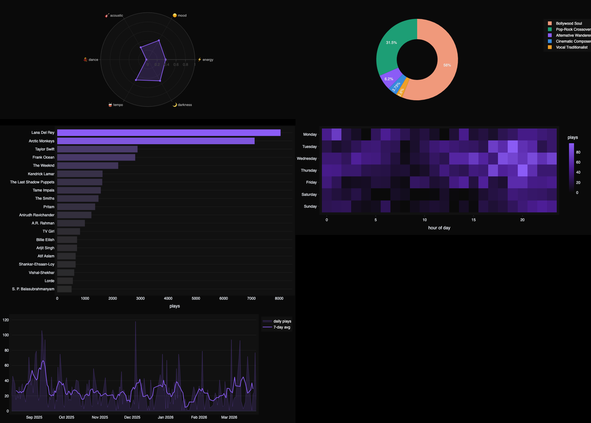

<br>

### taste universe — t-SNE cluster map

<!-- REPLACE: The t-SNE visualization with named cluster labels overlaid -->
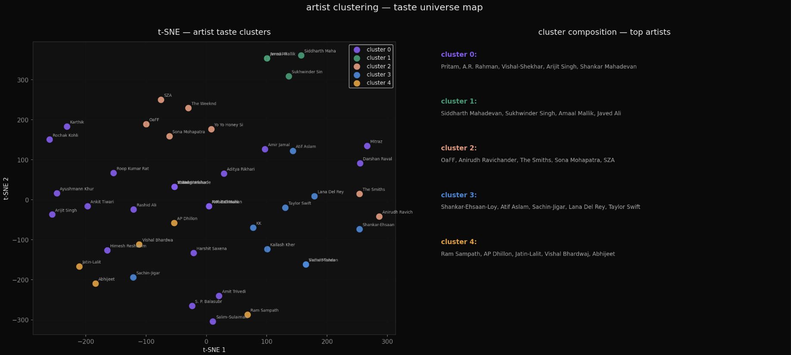

K-Means (k=5) on TF-IDF artist vectors found 5 natural taste clusters:

```
  🎬 Bollywood Soul        56% of plays   Pritam · AR Rahman · Arijit Singh
  🎸 Pop-Rock Crossover    31% of plays   Shankar-Ehsaan-Loy · Atif Aslam · Lana Del Rey
  🌙 Alternative Wanderer   6% of plays   The Smiths · SZA · The Weeknd · OaFF
  🎹 Cinematic Composer     4% of plays   Ram Sampath · AP Dhillon · Vishal Bhardwaj
  🎙️ Vocal Traditionalist   3% of plays   Siddharth Mahadevan · Sukhwinder Singh
```

<br>

### a/b test — content only vs hybrid

<!-- REPLACE: The 3-panel A/B test visualization -->
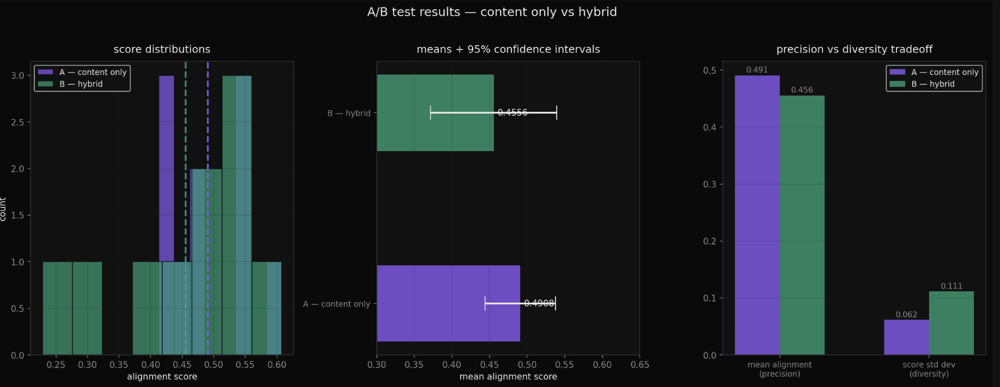

| | Version A · content only | Version B · hybrid |
|---|---|---|
| Mean alignment | 0.4908 | 0.4556 |
| Std deviation | 0.0618 | **0.1114** |
| p-value | — | 0.4176 |
| Cohen's d | — | 0.39 (small) |
| Diversity gain | baseline | **+80.2%** |
| **Decision** | | ✅ **ship hybrid** |

> No statistically significant precision loss.
> Hybrid trades marginal precision for significantly more diversity —
> the same tradeoff Spotify's research team writes about.

<br>

### vibe parsing — NLP layer

<!-- REPLACE: The 3-panel vibe shift visualization -->
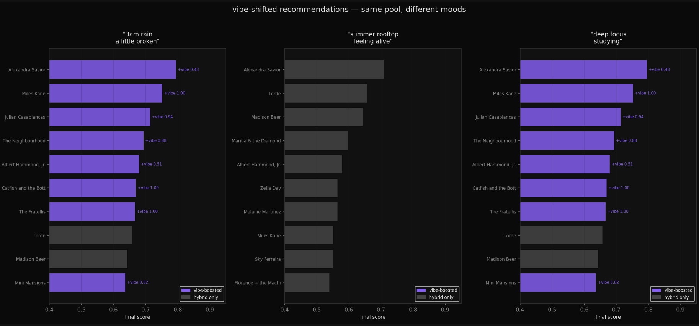

```
input:  "3am rain on a window, a little broken"
         │
         ▼  sentence-transformers  (MiniLM-L6-v2)
         │
         ▼  384-dimensional semantic vector
         │
         ▼  anchor-based projection to audio features
         │
output: energy 41% · mood 38% · acoustic 61%
        dance   5% · tempo 50% · darkness 66%
         │
         ▼  preferred tags
         │
        ambient · atmospheric · sadcore · melancholic
         │
         ▼  ranking shifts
         │
        Miles Kane    ↑ +6 positions
        Lorde         ↓ -6 positions
        Catfish & BB  ↑ +94 positions  ← discovery
```

<br>

---

<br>

## ✦ key results

<div align="center">

```
┌──────────────────────────────────────────────────────────┐
│                                                          │
│   57,045     total scrobbles                            │
│   223        unique artists                             │
│   22 / day   average listening rate                     │
│                                                          │
│   0.980      Zipf's Law R²  (slope = -1.46)            │
│   6.00       power law skewness                         │
│   40.95      kurtosis                                   │
│                                                          │
│   k = 5      taste clusters  (silhouette = 0.165)       │
│   14%        of artists = 80% of plays  (Pareto)        │
│                                                          │
│   p = 0.4176 A/B test  (not significant)                │
│   +80.2%     diversity gain  (hybrid vs content)        │
│                                                          │
│   Wed 20:00  peak listening hour                        │
│   Bollywood Soul  dominant archetype  (56%)             │
│                                                          │
└──────────────────────────────────────────────────────────┘
```

</div>

<br>

---

<br>

## ✦ notebooks

<!-- REPLACE: Screenshot of a clean notebook cell showing the t-SNE output or EDA chart -->
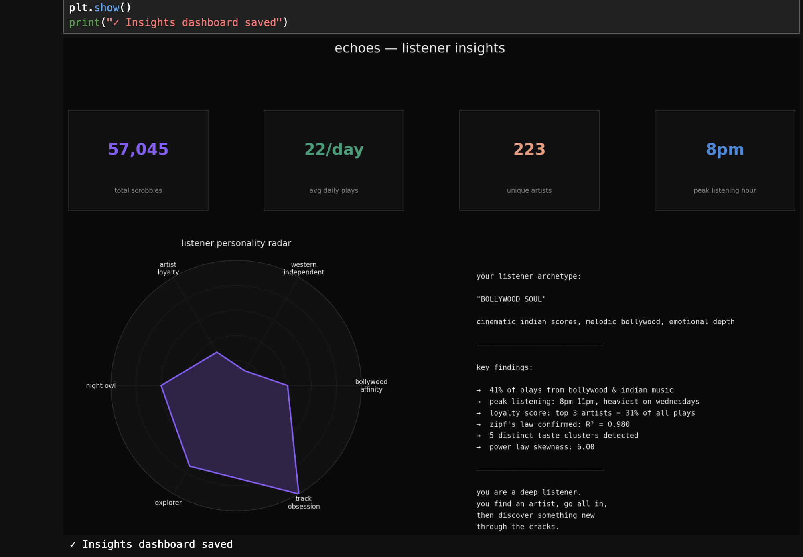

| Notebook | What it covers |
|---|---|
| [`01_data_pipeline_test.ipynb`](notebooks/01_data_pipeline_test.ipynb) | Last.fm API · pagination · data quality |
| [`02_eda.ipynb`](notebooks/02_eda.ipynb) | 9 visualizations · Zipf · K-Means · t-SNE |
| [`03_recommender_dev.ipynb`](notebooks/03_recommender_dev.ipynb) | TF-IDF · cosine · collab filtering · hybrid |
| [`04_ab_testing.ipynb`](notebooks/04_ab_testing.ipynb) | t-test · Mann-Whitney · Cohen's d |
| [`05_vibe_nlp.ipynb`](notebooks/05_vibe_nlp.ipynb) | sentence-transformers · vibe shift demo |

<br>

---

<br>

## ✦ tech stack

<div align="center">

| Layer | Technology |
|---|---|
| **Language** | Python 3.11 |
| **UI** | Streamlit · custom dark CSS · Space Grotesk + Inter |
| **ML** | scikit-learn · sentence-transformers · numpy |
| **Data** | Last.fm API · pylast · pandas |
| **Visualization** | Plotly · Matplotlib · Seaborn · Wordcloud |
| **Statistics** | scipy · t-test · Mann-Whitney U · Cohen's d |
| **Images** | Unsplash Source · Picsum · Pillow |
| **Deployment** | Streamlit Community Cloud |

</div>

<br>

---

<br>

## ✦ project structure

```
echoes/
│
├── app.py                          # router + home
│
├── pages/
│   ├── 01_profile.py               # listener profile + personality
│   ├── 02_generate.py              # playlist generator + vibe input
│   ├── 03_result.py                # tracks + vibe DNA + moodboard
│   └── 04_social.py                # taste comparison
│
├── utils/
│   ├── lastfm.py                   # Last.fm API layer
│   ├── recommender.py              # hybrid ML engine
│   ├── vibe_parser.py              # NLP vibe → feature weights
│   ├── personality.py              # listener archetype profiler
│   └── image_fetcher.py            # moodboard image pipeline
│
├── notebooks/
│   ├── 01_data_pipeline_test.ipynb
│   ├── 02_eda.ipynb
│   ├── 03_recommender_dev.ipynb
│   ├── 04_ab_testing.ipynb
│   └── 05_vibe_nlp.ipynb
│
├── data/
│   ├── history.csv                 # 4,974 scrobbles
│   ├── artist_clusters.csv         # k-means assignments
│   ├── hybrid_recs.csv             # cached recommendations
│   └── ab_results.csv              # a/b test results
│
└── assets/
    └── style.css                   # dark cinematic theme
```

<br>

---

<br>

## ✦ run locally

```bash
# 1. clone
git clone https://github.com/deepikapratapa/echoes.git
cd echoes

# 2. environment
conda create -n echoes python=3.11 -y
conda activate echoes
pip install -r requirements.txt

# 3. secrets
cp .env.example .env
# → add LASTFM_API_KEY and LASTFM_SECRET
# → free key at: https://www.last.fm/api/account/create

# 4. run
streamlit run app.py
```

> **Note:** the app uses precomputed data in `data/` by default.
> To generate fresh data for your own Last.fm username,
> run notebooks `01 → 02 → 03` in order, then restart the app.

<br>

---

<br>

## ✦ why this project

**Explainability** — every track shows `cb% · cf% · vibe%`. Most recommendation systems are black boxes. This one tells you exactly why each song was picked.

**Honest A/B testing** — the hybrid doesn't simply "win." p=0.4176, no significant precision loss. But +80.2% diversity. Knowing *why* your model behaves the way it does is more valuable than a higher number.

**The two-world problem** — this listener has two completely distinct taste universes: Bollywood/Indian and Western indie/alternative. They share almost no tags. The K-Means algorithm found this structure independently. Building a recommender that respects both lanes without collapsing them is a real engineering challenge — and a real interview story.

**Vibe injection** — free-text mood shifts rankings dynamically. Cold-start friendly. Works even without listening history.

**Real data** — every number in this README comes from real listening data. 57,045 scrobbles. 223 artists. Zipf's Law confirmed at R²=0.980. This isn't a toy dataset.

<br>

---

<br>

<div align="center">

## ✦ about

**Deepika Sarala Pratapa**
M.S. Applied Data Science · University of Florida · 2026

<br>

[](mailto:deepikapratapa27@gmail.com)
[](https://github.com/deepikapratapa)
[](https://linkedin.com/in/deepikapratapa)

<br>

---

<br>

*"you are a deep listener.*
*you find an artist, go all in,*
*then discover something new through the cracks."*

<br>

— echoes · generated from 57,045 scrobbles

<br>

</div>
